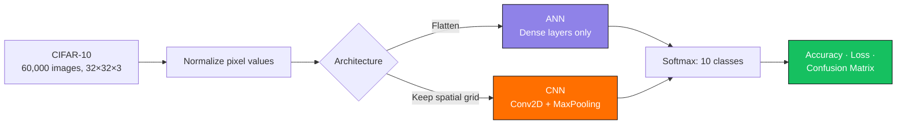

<a name="top"></a>
<div align="center">

# 🖼️ Image Classification: ANN vs CNN

### Do convolutions actually matter? CIFAR-10 says yes.

[](https://python.org)
[](https://tensorflow.org)
[](https://keras.io)
[](https://jupyter.org)


A head-to-head comparison of a fully-connected **Artificial Neural Network** and a **Convolutional Neural Network** on CIFAR-10 — same data, same output layer, very different results.

[Dataset](#-dataset) · [Models](#%EF%B8%8F-models-implemented) · [Stack](#%EF%B8%8F-tech-stack) · [Quickstart](#%EF%B8%8F-installation) · [Results](#-results)

</div>

---

## 🎯 Why this comparison

It's easy to say "CNNs are better for images" — this project puts a number on *how much* better, using the exact same dataset and training setup for both architectures. The ANN treats an image as a flat vector of pixels; the CNN treats it as a spatial grid. The accuracy gap is the cost of throwing away that spatial structure.



---

## 📊 Dataset

- **CIFAR-10** — 60,000 color images, 32×32 pixels each
- **10 categories**: airplane, automobile, bird, cat, deer, dog, frog, horse, ship, truck
- Preprocessed with pixel normalization before training

---

## 🚀 Features

| Feature | Description |
|---|---|
| 🧹 **Preprocessing** | Pixel normalization for stable training |
| 🔷 **ANN model** | Fully-connected baseline |
| 🔶 **CNN model** | Convolution + pooling for spatial feature extraction |
| 📈 **Evaluation** | Accuracy, loss curves, and a full classification report |
| 🖼️ **Visualizations** | Sample images with labels, confusion matrix, predicted vs. actual classes |

---

## 🛠️ Models Implemented

### 🔹 Artificial Neural Network (ANN)
- **Input**: flattened 32×32×3 images → 3,072-length vector
- Dense layers with ReLU and Sigmoid activations
- **Output**: 10 neurons, Softmax

### 🔹 Convolutional Neural Network (CNN)
- Conv2D layers with ReLU activation
- MaxPooling2D layers for downsampling
- Dense layers for final classification
- **Output**: 10 neurons, Softmax

---

## 🧱 Tech Stack


---

## 🗂️ Project Structure

```
cifar10-ann-cnn/
├── ANN_Project.ipynb        # Main notebook — ANN + CNN, side by side
├── README.md                # Project documentation
└── requirements.txt         # Python dependencies
```

---

## ⚙️ Installation

Clone the repository:

```bash
git clone https://github.com/your-username/cifar10-ann-cnn.git
cd cifar10-ann-cnn
```

Install dependencies:

```bash
pip install -r requirements.txt
```

---

## ▶️ Usage

Run the notebook:

```bash
jupyter notebook ANN_Project.ipynb
```

Steps performed:

1. Load the CIFAR-10 dataset
2. Normalize image data
3. Train the ANN and CNN models
4. Evaluate using accuracy and a classification report

---

## 📊 Results

| Model | Test Accuracy |
|---|---|
| ANN | ~44% |
| CNN | ~57% |

- The ANN struggles with raw pixel data — flattening the image throws away spatial relationships between neighboring pixels.
- The CNN outperforms it by a wide margin, since convolutional filters can actually learn edges, textures, and shapes.

---

## 🔮 Future Enhancements

- [ ] Deeper CNN with dropout & batch normalization
- [ ] Try modern architectures (ResNet, VGG, etc.)
- [ ] Deploy as a web app for real-time classification

---

## 🤝 Contributing

Contributions are welcome — fork the repo, add features, and submit a PR.

<div align="center">

<a href="#top">⬆️ Back to top</a>

</div>
